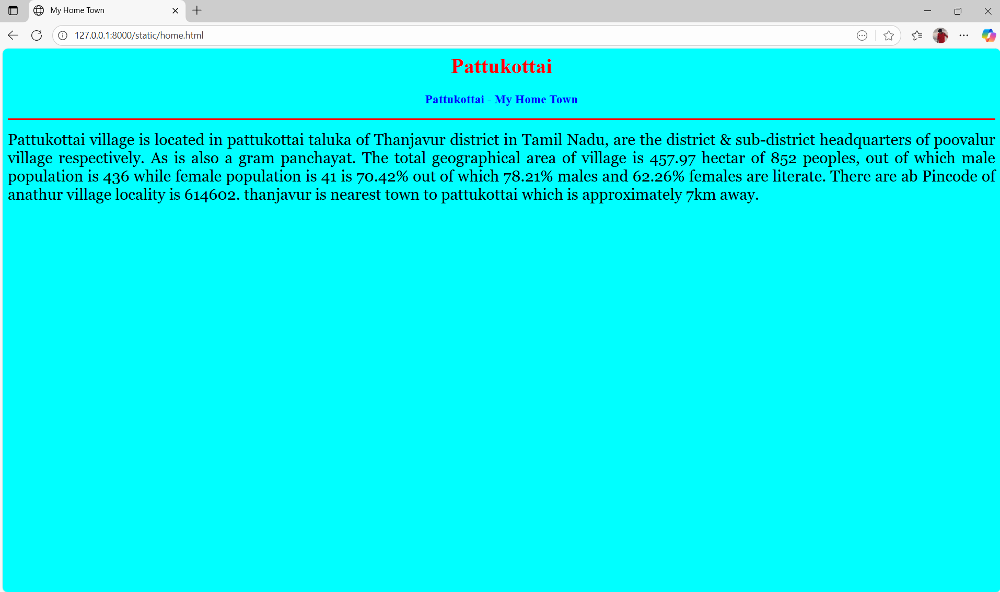
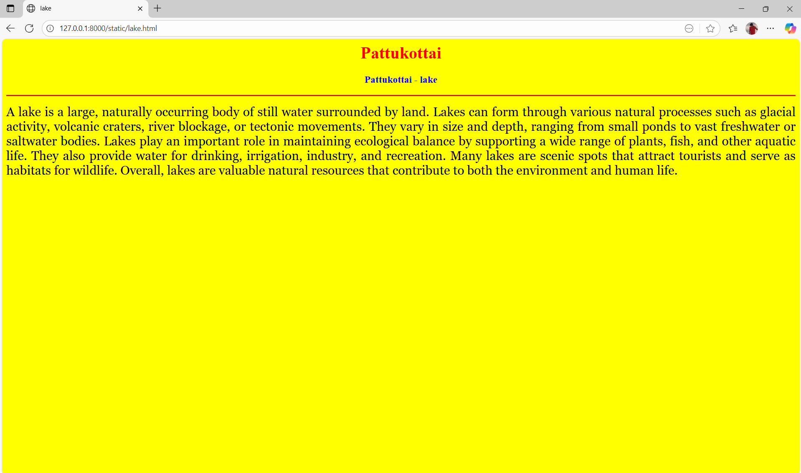
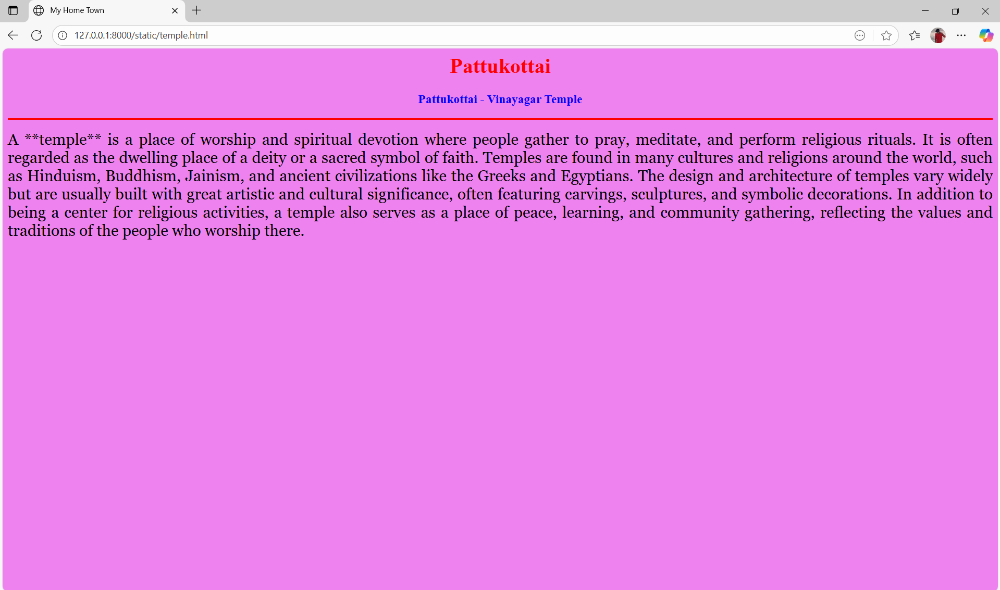
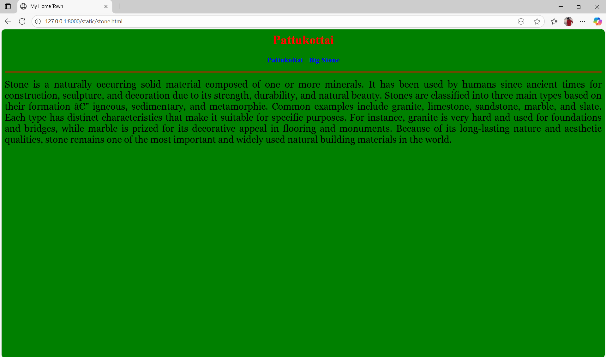

# Ex04 Places Around Me
## Date: 30-10-2025

## AIM
To develop a website to display details about the places around my house.

## DESIGN STEPS

### STEP 1
Create a Django admin interface.

### STEP 2
Download your city map from Google.

### STEP 3
Using ```<map>``` tag name the map.

### STEP 4
Create clickable regions in the image using ```<area>``` tag.

### STEP 5
Write HTML programs for all the regions identified.

### STEP 6
Execute the programs and publish them.

## CODE
'''
map.html


<html>

<head>

<title>My City</title>

</head>
<body>

<h1 align="center">

<font color="red"><b>pattukottai</b></font>

</h1>

<h3 align="center">

<font color="blue"><b>Sivahariharan J (25018631)</b></font> </h3>

<center>

 
<map name="MyCity">

<area shape="rect" coords="700,250,850,400" href="home.html" title="My Home Town">
<area shape="rect" coords="570,230,45" href="temple.html" title="vinayagar temple">
<area shape="rect" coords="640,200,30" href="lake.html" title="cavery river">
<area shape="rect" coords="950,120,1100,140" href="stone.html" title="big stone">

</map>

</center>

</body>

</html>

home.html

<html>
    <head>
        <title>My Home Town</title>
        </head>

<body bgcolor="cyan">

<h1 align="center">

<font color="red"><b>Pattukottai</b></font>

</h1>


<h3 align="center">


<font color="blue"><b>Pattukottai - My Home Town</b></font>


</h3>


<hr size="3" color="red">


<p align="justify">


<font face="Georgia" size="5">


Pattukottai  is located in pattukottai taluka of Thanjavur district in Tamil Nadu,
 are the district & sub-district headquarters of poovalur village respectively.
  As is also a gram panchayat. 
  The total geographical area of village is 457.97 hectar of 852 peoples, 
  out of which male population is 436 while female population is 41 is 70.42% out of 
  which 78.21% males and 62.26% females are literate. 
  There are ab Pincode of anathur village locality is 614602. 
thanjavur is nearest town to pattukottai which is approximately 7km away.</font>


</p>


</body>

</html>
    </head>
</html>

laake.html

<html>
    <head>
        <title>lake</title>
        </head>

<body bgcolor="yellow">

<h1 align="center">

<font color="red"><b>Pattukottai</b></font>

</h1>


<h3 align="center">


<font color="blue"><b>Pattukottai - lake</b></font>


</h3>


<hr size="3" color="red">


<p align="justify">


<font face="Georgia" size="5">


A lake is a large, naturally occurring body of still water surrounded by land.
 Lakes can form through various natural processes such as glacial activity, volcanic 
 craters, river blockage, or tectonic movements. They vary in size and depth, 
 ranging from small ponds to vast freshwater or saltwater bodies. Lakes play an 
 important role in maintaining ecological balance by supporting a wide range of plants,
  fish, and other aquatic life. They also provide water for drinking, irrigation, industry,
   and recreation. Many lakes are scenic spots that attract tourists and serve as habitats for wildlife. Overall, 
lakes are valuable natural resources that contribute to both the environment and human life.</font>


</p>


</body>

</html>
    </head>
</html>

stone.html

<html>
    <head>
        <title>My Home Town</title>
        </head>

<body bgcolor="green">

<h1 align="center">

<font color="red"><b>Pattukottai</b></font>

</h1>


<h3 align="center">


<font color="blue"><b>Pattukottai - Big Stone</b></font>


</h3>


<hr size="3" color="red">


<p align="justify">


<font face="Georgia" size="5">


Stone is a naturally occurring solid material composed of one or more minerals. 
It has been used by humans since ancient times for construction, sculpture, and 
decoration due to its strength, durability, and natural beauty. 
Stones are classified into three main types based on their formation — igneous, 
sedimentary, and metamorphic. Common examples include granite, limestone, sandstone,
 marble, and slate. Each type has distinct characteristics that make it suitable for specific purposes. For instance, granite is very hard and used for foundations and bridges, while marble is prized for its decorative appeal in flooring and monuments. Because of its long-lasting nature and aesthetic qualities, stone remains 
one of the most important and widely used natural building materials in the world.</font>


</p>


</body>

</html>
    </head>
</html>

temple.html

<html>
    <head>
        <title>My Home Town</title>
        </head>

<body bgcolor="violet">

<h1 align="center">

<font color="red"><b>Pattukottai</b></font>

</h1>


<h3 align="center">


<font color="blue"><b>Pattukottai - Vinayagar Temple</b></font>


</h3>


<hr size="3" color="red">


<p align="justify">


<font face="Georgia" size="5">


A **temple** is a place of worship and spiritual devotion where people gather to pray,
 meditate, and perform religious rituals. It is often regarded as the dwelling place 
 of a deity or a sacred symbol of faith. Temples are found in many cultures and religions 
 around the world, such as Hinduism, Buddhism, Jainism, and ancient civilizations like 
 the Greeks and Egyptians. The design and architecture of temples vary widely but are 
 usually built with great artistic and cultural significance, often featuring carvings, 
 sculptures, and symbolic decorations. In addition to being a center for religious 
 activities, a temple also serves as a place of peace, learning, and community gathering, 
 reflecting the values and traditions of the people who worship there.
</font>


</p>


</body>

</html>
    </head>
</html>

'''


## OUTPUT






## RESULT
The program for implementing image maps using HTML is executed successfully.
